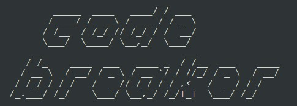
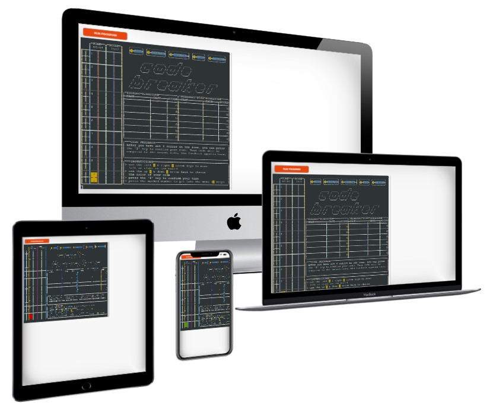
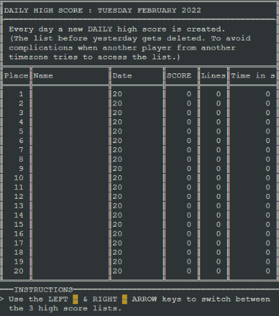
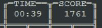
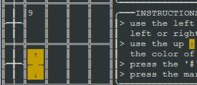
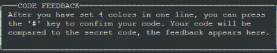

# Code Breaker  
"Code Breaker" **is a Python terminal game**, which runs in the Code Institute mock terminal on Heroku.  

The player has 10 turns to find out what the secret code is.  Every turn the player gets some clues which can help to find out the code before his last turn is played.  

Can you break the code and set a new high score ???

[follow the link to the live version of "Code Breaker"](https://curses-code-breaker.herokuapp.com/)  

---
## How to play
**"Code Breaker"** is based on the board game ["Master Mind"](https://en.wikipedia.org/wiki/Mastermind_(board_game)). The secret code is made up of 4 colors, which can be red, green, blue, yellow. The player wins if he sets the right color in the right order. After every turn, the player gets feedback ...  
- how many of the set colors and positions where correct  
- how many colors where correct but the position was wrong  

A score is calculated based on how many of the 10 lines are still free and how long the player needed to find out the secret code. If the play has not found out the secret code after the 10th turn, then he lost the game and does not get any points.

---
## Features
### Existing Features  
- random secret code generation
- 3 different high scores for the user to write his points in
  
  - every high score list has a maximum of 20 entries, the lowest falls out
  - the high score data is saved in a Google spreadsheet, every player writes to the same high score
  - the high scores get updated and can be viewed within the game
  - DAILY high score:
    - is set everyday new
    - only the day before yesterday gets overwritten, to avoid conflicts when player play in different time zones
  - MONTHLY high score:
    - for every month there is a new high score which is kept in the Google sheet database but is not accessible for the users
  - ALL TIME high score:
    - the best ever saved scores in the game
- a live timer counting the time the player has played and points in real time
  
  (is done over "Multithreading & Multiprocessing in Python3")
- intuitive game and menu navigation (only arrow keys, some numbers and the '#' key are needed)
  
- 'curses' is used for a terminal-independent screen-painting and keyboard-handling facility for text-based terminals, which makes the terminal app more appealing
- detailed feedback:
  - code feedback (in which line, how many color and position or only color is correct)
  
  - score feed back, detailed point calculation (how many lines where left, how long has the user played)
  - high score feedback (who has fallen out, what date was the score set, how many lines and time in seconds)
  - visual feedback, what options are available and in which menu the user is through text highlighting
  
### Future Features  
- 'curses' could be used to animate the 'code breaker' logo
- more code documentation (comments and a control flow graph diagram)
---
## Data Model
- the code is structured into modules
  - run.py is the executable main code where everything comes together
  - spreadsheet.py handles the Google sheet data requests
  - menu.py contains the data to draw the menus (main manu, contact, help, archive)
  - player.py contains the player information (name, position, score, time, ...)
- the code is mainly object-oriented, grouped in classes
- lists have been used to store coordinates which are needed to 'draw' on the screen
- the score data is stored in lists of lists which are updated or created from and to Google sheet
- regular expression have been used to read the file name from the Google sheet
---
## Testing
- The app was constantly tested in the terminal during development and over heroku. 

### Bugs

#### Solved Bugs
- the curses module can not draw larger than the terminal window, this coursed many bugs in the beginning
- there were to many request to 'gspread' when a new month and new day high score list was created, I have reduced the  
  request by not updating every single cell but making a template and updating the whole template at once. 
#### Remaining Bugs
- the curser should be disabled, can be easily done in the terminal but curses errors in the browser terminal  
### Validator Testing
- **PEP8**
  - there are warnings but no errors on PEP8, which are mainly because of to long lines but the code is more readable
  with it because of the commenting large lists of lists.

---
## Deployment
This project was deployed using Code Institute's mock terminal for Heroku.  
- Steps for deployment:  
1. get the [code institute template](https://github.com/Code-Institute-Org/python-essentials-template) for the python mock terminal from github  
2. create a Heroku app  
3. set the build-packs to **Python** and **NodeJS** in that order  
4. link the Heroku app to this repository  
5. **deploy** in Heroku  

---
## Credits
- Special thanks to **TechWithTim** for his curses tutorial [curses tutorial](https://www.youtube.com/watch?v=Db4oc8qc9RU)
- **Computer Science Tutorials** [Background Timer with Threading](https://www.youtube.com/watch?v=Mp6YMt8MSAU&list=PLp7Da7zIod3RhV6WC_svR8tem_EtwDkJ6&index=5&t=239s)
- Regular Expression in Python [pynative.com](https://pynative.com/python/regex/)
- Curses Programming with Python [curses](https://docs.python.org/3/howto/curses.html)

- I want to thank my mentor [Spencer Barriball](https://5pence.net/javascript-promise-overview/) and [Code Institute](https://codeinstitute.net/full-stack-software-development-diploma/?utm_term=code%20institute&utm_campaign=CI+-+UK+-+Search+-+Brand&utm_source=adwords&utm_medium=ppc&hsa_acc=8983321581&hsa_cam=1578649861&hsa_grp=62188641240&hsa_ad=581813982401&hsa_src=g&hsa_tgt=kwd-319867646331&hsa_kw=code%20institute&hsa_mt=e&hsa_net=adwords&hsa_ver=3&gclid=Cj0KCQiAu62QBhC7ARIsALXijXQA-rNraXsPBnS6GC-yI6XnWYXo_VHZatzUHI-W0HrTKtnt-WxebWMaAld0EALw_wcB) for their support.