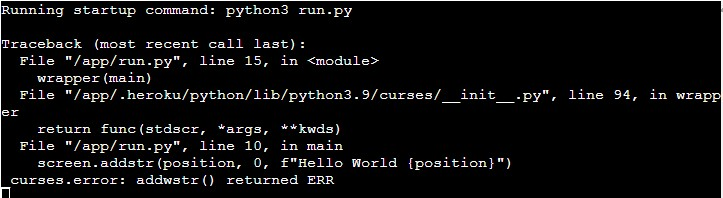

 - pip freeze > requirements.txt
 - do not add windows-curses==xxx to requirements.txt, not working with Heroku (only needed for windows not for Linux, MOS)
 - vertical lines exceed original terminal error (terminal 24 rows but print 30 rows) 

 - create pad in curses
    -     zolsk_pad = curses.newpad(1, 6)  # creates pad, 1 row and 6 colomns  
    -     zolsk_pad.addstr("Z")  # add string ('z') to pad  
    -     zolsk_pad.refresh(0, 0, 0, 0, 1, 0)  # needs to be refreshed so it appears on screen
      - pad.refresh(  
      **0** *from screen top*, **0** *from screen left*,  
    **0** *from pad top*, **0** *from pad left*,  
    **1** *end of pad from top*, **0** *end of pad from left (-1 character e.g. 0 for 1 character only display*)  